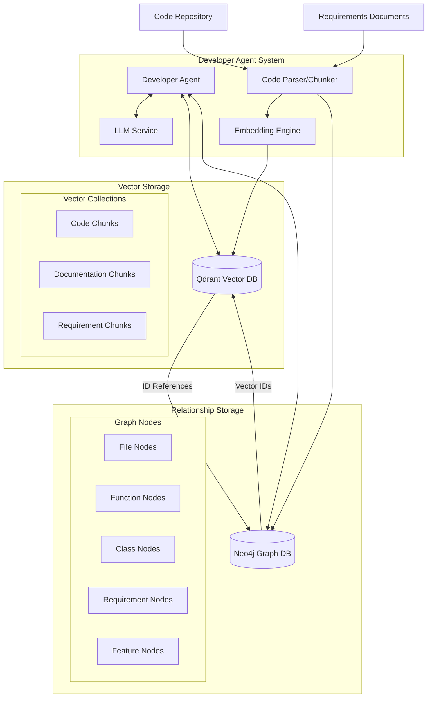

# Fluxio Agents

A Python server that serves as the foundation for a developer agent system. This system processes code repositories and requirements documents, storing them in vector and graph databases to enable intelligent code understanding and manipulation.

## Architecture

## Core Components

1. **Developer Agent**: Interfaces with the LLM service and databases to perform development tasks
2. **Code Parser/Chunker**: Processes code repositories and requirements documents
3. **Embedding Engine**: Converts code and documentation into vector embeddings
4. **Vector Storage (Qdrant)**: Stores embeddings for semantic search
5. **Relationship Storage (Neo4j)**: Maintains the relationships between code elements

## Getting Started

[Installation and usage instructions will be added]